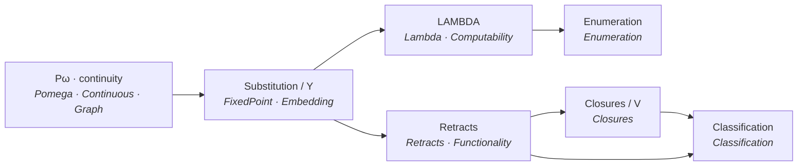
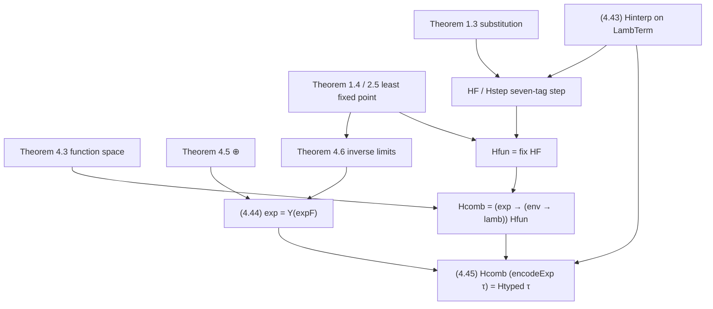
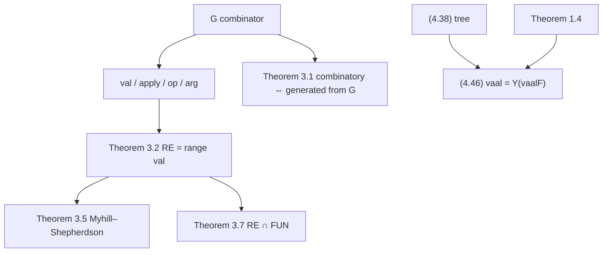
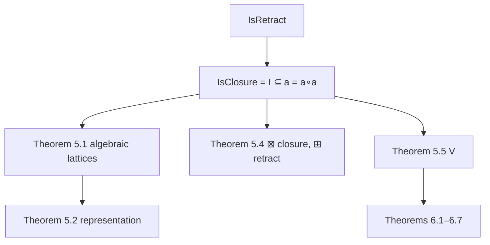

# A Lean 4 Formalization of Scott's Data Types as Lattices (1976)

**Author.** Lars Warren Ericson (Catskills Research Company).
**Source paper.** Dana S. Scott, *Data Types as Lattices*, Technical Monograph
PRG-5, Oxford University Computing Laboratory, Programming Research Group,
September 1976; reprinted SIAM J. Comput. 5 (1976), 522–587.
**Repository.** https://github.com/catskillsresearch/scott1976

---

## Abstract

This note records a Lean 4 / mathlib formalization of Dana Scott's 1976 paper
*Data Types as Lattices*. Scott develops the graph model of the λ-calculus
inside the complete lattice $\mathbf{P}\omega$ of subsets of the natural
numbers, then uses retracts of that lattice as data types. The Lean
development is a 1:1 onto translation of every numbered definition, theorem,
displayed equation used as a definition or example, and Tables 1–3.

The sorry-free library consists of approximately 17,000 lines in 15 files
under `Scott1976/` (the root import plus fourteen modules). Palomar Challenge
/ Solution files name every numbered theorem from §§1–7 (45 compared
declarations, including the packaged forms `theorem_4_4_typed`,
`theorem_4_5_sum`, `theorem_5_4_plus`, and `theorem_5_5_universe`) and lock
64 core definitions, so a Comparator match requires the graph model, LAMBDA,
enumeration, retracts, closures, classification, and functionality.

The repository has no project-defined axioms and no Lake dependency beyond
mathlib. Completed proofs use the standard classical mathlib footprint
`[propext, Quot.sound, Classical.choice]`. Deliberate proof holes occur only
in the Mathlib-only `Challenge.lean`; `Solution.lean` re-exports the
kernel-checked development.

Dana Scott was not contacted and did not participate in, review, or endorse
this formalization. Lean code was written by AI agents under the direction
and review of the author, who takes sole responsibility for the mathematical
content.

Proofs in this note are summarized at the level of their main constructions.
Short representative Lean fragments are copied from the library; a generated
review copy with the complete source appendix is available through
(`scripts/generate_arxiv_with_code.sh` → `arxiv_with_code.md`).

<!-- AI_MODEL_TOOL_BULLETS -->
<!-- /AI_MODEL_TOOL_BULLETS -->

## 1. Introduction

Scott's monograph answers a single question in several registers: what is a
data type, if types are to be lattices and programs are to be continuous
maps? The carrier is $\mathbf{P}\omega$, the power set of $\mathbb{N}$,
ordered by inclusion. Finite subsets $e_n$ are a countable basis. A map
$f:\mathbf{P}\omega\to\mathbf{P}\omega$ is continuous when it preserves
directed unions, equivalently when $f(x)=\bigcup\{f(e_n)\mid e_n\subseteq x\}$.
Continuous maps are encoded as graphs and recovered by application, so the
function space lives inside $\mathbf{P}\omega$ itself.

LAMBDA is the combinatory language of that encoding. Its interpretation is
continuous in every free variable (Theorem 2.3), conversion is sound
(Theorem 2.2), and a continuous map is computable exactly when its graph is
recursively enumerable, equivalently combinatory, equivalently
LAMBDA-definable (Theorem 2.6). Enumeration then internalizes Gödel numbering:
`val` enumerates the combinatory subalgebra $\mathbf{RE}$, the second
recursion theorem and Myhill–Shepherdson appear as continuity facts, and
degrees of unsolvability are finitely generated combinatory subalgebras.

Retracts of $\mathbf{P}\omega$ are the data types. The constructions
$a\circ\to b$, $a\otimes b$, and $a\oplus b$ are themselves retracts when $a$
and $b$ are, inverse limits exist by the fixed-point theorem, and recursive
domain equations such as

$$
\mathbf{lamb}=\mathbf{int}\oplus(\mathbf{lamb}\circ\to\mathbf{lamb}),
\qquad
\mathbf{exp}=\mathbf{int}\oplus\mathbf{nil}\oplus\mathbf{exp}\oplus\mathbf{exp}\oplus(\mathbf{exp})^4\oplus(\mathbf{exp}\otimes\mathbf{exp})\oplus(\mathbf{int}\otimes\mathbf{exp})
$$

are solved in place. Closures classify algebraic lattices; $V$ is a universe
of closures. The Borel/analytic hierarchy of §§6–7 is expressed with
continuous preimages and equalizers, and restricted equivalences make the
combinators $I,K,S$ and the iterators functional.

The formalization follows this mathematical decomposition rather than treating
the forty-odd numbered theorems as unrelated endpoints. It also records where
a proof route is paper-accurate but weaker than a tempting modern reading:
most importantly, the sum $\boxplus$ of Theorem 5.4 is the strict retract of
(4.4)/(5.13), not a closure.

## 2. Scope and layout

The library has 15 Lean files and approximately 17,000 lines. The root module
`Scott1976.lean` imports the complete development; `Basic.lean` is a thin
facade. `Solution.lean` imports `Scott1976/*`.

| Module | Role |
| --- | --- |
| `Pomega` | $\mathbf{P}\omega$, $e_n$, $\bot$, $\top$, pairing |
| `Continuous` | Scott-open sets, continuity, Theorem 1.1 |
| `Graph` | `graph` / `fun`, Theorem 1.2 |
| `FixedPoint` | Substitution, least fixed points, Theorems 1.3–1.4 |
| `Embedding` | Extension and embedding, Theorems 1.5–1.6 |
| `Lambda` | Table 1–2, combinators, Theorems 2.1–2.5 |
| `Computability` | r.e. graphs, Theorem 2.6 (unary and $k$-ary) |
| `Enumeration` | `G`, `val`, Theorems 3.1–3.7, `vaal` |
| `FixedLattices` | Algebraic and continuous lattices (support) |
| `Retracts` | Retracts, $\circ\to$, $\otimes$, $\oplus$, Theorems 4.1–4.6, `exp` |
| `Functionality` | (4.38)–(4.45) `tree`/`lamb`/`ℋ`, Theorems 7.1–7.4 |
| `Closures` | Closures, $V$, Theorems 5.1–5.6 |
| `Classification` | $\mathfrak{G},\mathfrak{F},\mathfrak{B}$, Theorems 6.1–6.7, Table 3 |
| `Challenge` / `Solution` | Palomar statement of record and sorry-free realization |

The published scope is the numbered items of §§1–7 together with Tables 1–3.
Two source-facing notes remain visible in the inventory and are not missing
proofs:

- Theorem 4.5's informal coproduct non-uniqueness remark is omitted;
- Theorem 5.4's sum $\boxplus$ is a retract, not a closure, because (5.13) is
  the strict conditional of (4.4).

The project is standalone. It imports none of the sibling formalizations of
Scott's later domain-theory papers. Cross-presentation equivalences live in
the separate `scott_models` repository.

## 3. How the proofs use mathlib

Mathlib supplies the set-theoretic and classical substrate. The predicates
and reductions specific to Scott's paper are defined in this repository.

**Power sets and directed unions.** $\mathbf{P}\omega$ is `Set ℕ`. Directed
suprema are ordinary unions of directed families; the finite basis $e_n$ is
an explicit pairing enumeration. Continuity is the equality
$f(x)=\bigcup_n f(e_n)$ on $e_n\subseteq x$, not a topology imported from
mathlib's Scott topology.

**Classical graphs.** Application `funOf u x` decodes pairs from the graph
of $u$. Least fixed points are $\bigcup_n f^n(\varnothing)$. The only
axioms that appear are mathlib's standard classical triple.

**Recursion and combinators.** Syntax of LAMBDA and of the modified language
`LambTerm` is an inductive type. Interpretation lemmas are ordinary
structural induction. Primitive-recursive arithmetic on codes uses mathlib
`ℕ` lemmas; r.e. sets are ranges of combinatory enumerations, not an imported
computability library.

**Retracts as idempotents.** A retract is a graph $a$ with $a=a\circ a$.
Typedness $x:a$ is the equation $x=a(x)$. Inverse limits of retracts are
constructed from the iterates of a continuous functor by Theorem 1.4 /
Theorem 4.6, not from a categorical limit API.

What mathlib does not supply is Scott's interface: graphs of continuous maps
on $\mathbf{P}\omega$, LAMBDA conversion, the combinatory algebra $\mathbf{RE}$,
retract constructors $\circ\to$/$\otimes$/$\oplus$, closures and $V$, or the
$\mathfrak{G}/\mathfrak{F}/\mathfrak{B}$ classification. Those constructions
are developed here.

## 4. Proof dependency structure

The published development is one lattice-theoretic core and six applications.



Section 4's domain examples depend on the retract constructors and on the
fixed-point theorem. The continuous decoder $\mathcal{H}$ of (4.45) is the
least fixed point of a syntax-directed operator, then retracted onto
$\mathbf{exp}\circ\to(\mathbf{env}\circ\to\mathbf{lamb})$:



Enumeration and the tree evaluator (4.46) are a parallel use of the same
fixed-point pattern:



Closures reuse retracts but add $I\subseteq a$:



## 5. Living inventory

Status words:

- `faithful` — Lean statement matches Scott; library proof is sorry-free.
- `partial` — a named Lean declaration exists but is weaker than a tempting
  modern strengthening; the Lean statement is paper-accurate.
- `missing` — no faithful Lean declaration yet.

Nothing is `missing`. The only `partial` item is Theorem 5.4's sum.

The Palomar Comparator currently selects every numbered theorem:

- §1: `theorem_1_1`–`theorem_1_6`
- §2: `theorem_2_1`–`theorem_2_6`
- §3: `theorem_3_1`–`theorem_3_7`
- §4: `theorem_4_1`–`theorem_4_6` (with `theorem_4_4_typed`, `theorem_4_5_sum`)
- §5: `theorem_5_1`–`theorem_5_6` (with `theorem_5_4_plus`, `theorem_5_5_universe`)
- §6: `theorem_6_1`–`theorem_6_7`
- §7: `theorem_7_1`–`theorem_7_4`

### §1 Continuous functions

| Item | Lean | Status |
|---|---|---|
| Def. `Pω`, `e_n`, `⊥`, `⊤`, `pair` | `Pomega`, `e`, `botElem`, `topElem`, `pair` | faithful |
| Def. basic neighbourhood / Scott-open | `basicNhhd`, `IsScottOpen` | faithful |
| Def. continuity `f(x)=⋃ f(e_n)` | `IsScottContinuous` | faithful |
| Def. `graph`, `fun` | `graph`, `funOf` | faithful |
| Theorem 1.1 | `theorem_1_1` | faithful |
| Theorem 1.2 | `theorem_1_2` | faithful |
| Theorem 1.3 | `theorem_1_3`, `theorem_1_3_nary` | faithful |
| Theorem 1.4 | `theorem_1_4` | faithful |
| Theorem 1.5 | `theorem_1_5`, `theorem_1_5_extends` | faithful |
| Theorem 1.6 | `theorem_1_6` | faithful |

### §2 LAMBDA

| Item | Lean | Status |
|---|---|---|
| Table 1 `(α)(β)(ξ)` | `theorem_2_2_alpha`, `theorem_2_2_beta`, `theorem_2_2_xi` | faithful |
| Table 1 `(η)` fails | `eta_fails` | faithful |
| Table 1 `(ξ*)(μ)` | `xi_star`, `table1_mu` / `mu_law` | faithful |
| Table 2 syntax/semantics | `Term`, `interp` | faithful |
| (2.1)(2.2) max/min extension | `maxExtend`, `minExtend`, `eq_2_1_empty`/`_singleton`/`_else` | faithful |
| (2.3)(2.4) relation/sum | `relComp`, `setSum` | faithful |
| (2.5)(2.6)(2.7) examples | `eq_2_5`, `eq_2_6`, `eq_2_7_bot`/`_zero`/`_succ`/`_pos`/`_mix` | faithful |
| (2.8) `Y` | `Ycomb`, `Ycomb_unfold` | faithful |
| (2.9)–(2.13) distribution | `eq_2_9` … `eq_2_13`, `eq_2_11_graphs` | faithful — (2.11) equality when both arguments are graphs |
| (2.14)–(2.16) | `eq_2_14`, `eq_2_15`, `union_via_cond`, `eq_2_16` | faithful |
| `FUN` | `FUN` | faithful |
| (2.17) intersection encoding | `eq_2_17`, `eq_2_17_step`, `interC` | faithful |
| (2.18) `K`-fixed points | `eq_2_18` | faithful |
| (2.19)–(2.23) sequences | `seq0`, `seq1`, `seq2`, `seqCons`, `eq_2_22`, `eq_2_23_*` | faithful |
| (2.24)–(2.27) `$`, primrec | `eq_2_24`, `eq_2_24_Y`, `eq_2_24_Ycomb`, `dollarC`, `eq_2_25`, `lamOmega`, `eq_2_27`, `primRecVal_fix` | faithful — `$ = Y(step)`; `p̂ = $(Y(primRecStep))` |
| (2.28) `Y` commuting | `eq_2_28`, `eq_2_28_commute` | faithful |
| Theorem 2.1 | `theorem_2_1` | faithful |
| Theorem 2.2 | `theorem_2_2` | faithful |
| Theorem 2.3 | `theorem_2_3`, `_unary`, `_binary`, `_ternary` | faithful — any finite arity via nested graphs |
| Theorem 2.4 | `theorem_2_4`, `theorem_2_4_complete`, `erase` | faithful |
| Theorem 2.5 | `theorem_2_5` | faithful |
| Def. computable | `IsComputable` | faithful |
| Theorem 2.6 | `theorem_2_6`, `theorem_2_6_fin`, `IsComputableFin` | faithful — unary and `k`-ary; the nested graph is the pairing encoding of `m ∈ f(e n₀)⋯(e n_{k-1})` |

### §3 Enumeration

| Item | Lean | Status |
|---|---|---|
| `G` | `Gcomb`, `Gcomb_app_self` | faithful — `G(G)=0`; `G(⊥)=⊥` |
| (3.1)(3.2) | `eq_3_1`, `eq_3_2` | faithful |
| Theorem 3.1 | `theorem_3_1`, `GeneratedFromG` | faithful — combinatory iff generated from `G` alone |
| (3.4)–(3.7) `apply`, `op`, `arg`, `val` | `applyNat`, `opNat`, `argNat`, `valNat` | faithful — Scott's `val(0)=G`, `apply=(n,m)+1` |
| Theorem 3.2 | `theorem_3_2`, `theorem_3_2_range` | faithful — `RE = range val` with (i)(ii) |
| (3.8)–(3.12) | `eq_3_8_*` … `eq_3_12` | faithful |
| `fin` | `fin`, `valNat_fin` | faithful — `val(fin j)=e j` |
| Theorem 3.3 | `theorem_3_3`, `theorem_3_3_val` | faithful — primrec `v`/`rec` with (i)–(iii) |
| Theorem 3.4 | `theorem_3_4` | faithful — `¬IsRE {n | val n = ⊥}` |
| Theorem 3.5 | `theorem_3_5`, `myhillQ` | faithful — LAMBDA-definable extensional `p` yields LAMBDA-definable `q` with `val(p n) = q(val n)` |
| Theorem 3.6 | `theorem_3_6`, `theorem_3_6_generated` | faithful — enumeration degrees are exactly the finitely generated combinatory subalgebras |
| `R`,`L` | `Rcomb`, `Lcomb`, `Rcomb_app`, `Lcomb_app` | faithful |
| (3.15)–(3.17) | `barComb`, `eq_3_15`, `eq_3_16`, `eq_3_17` | faithful — `ū = Y(barStep)`; operator identities (3.16) and (3.17) |
| Theorem 3.7 | `theorem_3_7` | faithful — `RE ∩ FUN` is the semigroup generated by `R`, `L`, and `Ḡ` |

### §4 Retracts

| Item | Lean | Status |
|---|---|---|
| Def. retract, `u:a`, `⊑` | `IsRetract`, `typed`, `retractLe` | faithful |
| (4.1)–(4.10) combinators | `funRetract`, `arrowR`, `tensorR`, `plusR`, `dcondSet`, `boolR`, `intR`, … | faithful — (4.4) doubly strict conditional; (4.3) `bool` and (4.10) `⊕` use it; (4.7) `int` is `Y(intF)` with Scott's three-case table |
| Theorem 4.1 | `theorem_4_1`, `theorem_4_1_complete`, `theorem_4_1_continuous` | faithful — fixed points of a continuous map form a complete lattice; retract ranges are continuous lattices |
| Theorem 4.2 | `theorem_4_2` | faithful |
| Theorem 4.3 | `theorem_4_3`, `arrowR_isRetract` | faithful — (i)–(v) packaged |
| Theorem 4.4 | `theorem_4_4`, `theorem_4_4_typed`, `theorem_4_4_med`, `theorem_4_4_med_unique`, `tensorR_isRetract`, `tensorR_isStrict`, `tensorR_retractLe`, `tensorR_functor`, `eq_4_12`, `eq_4_17`–`eq_4_21`, `eq_4_24`, `eq_4_25`, `eval_curry` | faithful — product, mediator, CCC `eval`/`curry` |
| Theorem 4.5 | `theorem_4_5_sum`, `plusR_isRetract`, `plusR_typed_iff`, `plusR_retractLe`, `plusR_functor`, `eq_4_13`, `eq_4_32`–`eq_4_37`, `inleftC`, `inrightC`, `outleftC`, `outrightC`, `whichC`, `outC`, `boolR_isRetract` | faithful — (i)–(iv) packaged; coproduct non-uniqueness remark omitted |
| Theorem 4.6 | `theorem_4_6`, `theorem_4_6_limit` | faithful — `Y(F)` is a retract; under strictness and `⊑`-monotonicity the range is order-isomorphic to the inverse limit of the ranges of `Fⁿ(⊥)` |
| (4.38) `tree` | `treeR`, `eq_4_38`, `tree_atom`, `tree_node` | faithful — `tree = nil ⊕ (tree ⊗ tree)`; atom and binary nodes |
| (4.39)–(4.43) `lamb` | `lambR`, `envR`, `updateEnv`, `LambTerm`, `Hinterp` | faithful — data types and `ℋ` by recursion on finite terms |
| (4.44) `exp` | `expR`, `eq_4_44`, `expR_isRetract` | faithful — seven-tag syntax functor; `exp = Y(expF)` is a retract |
| (4.45) `ℋ` | `eq_4_45`, `HF`, `Hfun`, `Hcomb`, `Htyped`, `Hcomb_decode` | faithful — `ℋ` is the retract of the least fixed point of a continuous seven-tag operator; `Hcomb(encodeExp τ) = Htyped τ` |
| (4.46) `vaal` | `vaalC`, `vaalC_unfold`, `vaalC_combinatory`, `vaalC_typed` | faithful — `vaal : tree → id` as the least fixed point of (4.46), combinatory and typed |

### §5 Closures

| Item | Lean | Status |
|---|---|---|
| Def. closure `I ⊆ a = a∘a` | `IsClosure` | faithful |
| (5.1)–(5.13) pairing/box | `eq_5_1`, `eq_5_2`, `squarePair`, `boxTensor`, `boxPlus`, `funRetract_isClosure`, `boool` | faithful |
| Theorem 5.1 | `theorem_5_1`, `theorem_5_1_isolated` | faithful — closure fixed points form an algebraic lattice; compacts are the `a(e n)` |
| Theorem 5.2 | `theorem_5_2` | faithful — every countable algebraic lattice is order-isomorphic to the range of a closure |
| Theorem 5.3 | `theorem_5_3`, `theorem_5_3_closure`, `Icomb_subset_arrowR` | faithful |
| Theorem 5.4 | `theorem_5_4`, `theorem_5_4_plus`, `eq_5_12`, `eq_5_22`, `eq_5_23` | partial — `⊠` of closures is a closure and typed on `V`; `⊞` is a retract via (4.4); `I ⊆ ⊞` fails on empty tags because (5.13) is strict |
| Theorem 5.5 | `theorem_5_5`, `theorem_5_5_iff`, `theorem_5_5_universe`, `Vcomb`, `eq_5_14`, `eq_5_19`, `eq_5_21` | faithful — `V` is a closure; `V(a)=a` iff `a` is a closure; `(5.14)=(5.15)` |
| Theorem 5.6 | `theorem_5_6`, `theorem_5_6_iterates`, `eq_5_24` | faithful — `Y(f):V` whenever `f:V∘→V`; `∘→` typed on `V` |
| (5.25) `d = I ∪ (d∘→d)` | `dEq`, `eq_5_25` | faithful — `Y(λa. I ∪ (a∘→a))`; `d = d∘→d` if `I ⊆ d∘→d` |

### §6 Classification

| Item | Lean | Status |
|---|---|---|
| Def. `𝔊`,`𝔉`,`𝔅` | `ScottG`, `ScottF`, `ScottB` | faithful |
| Theorem 6.1 | `theorem_6_1` | faithful |
| Theorem 6.2 | `theorem_6_2` | faithful |
| Theorem 6.3 | `theorem_6_3` | faithful |
| Theorem 6.4 | `theorem_6_4` | faithful |
| Theorem 6.5 | `theorem_6_5` | faithful |
| Theorem 6.6 | `theorem_6_6` | faithful |
| Theorem 6.7 | `theorem_6_7` | faithful — `B_δ` sets are exactly equalizers of continuous maps |
| Table 3 typical sets | `typicalG` … `typicalPi11`, `typical*_universal` | faithful — each class is the continuous preimages of the typical set |

### §7 Functionality

| Item | Lean | Status |
|---|---|---|
| Def. restricted equivalence | `RestrictedEquiv` | faithful |
| (7.4)–(7.8) `E_a`, `→`, `×`, `+` | `Ea`, `arrowE`, `prodE`, `sumE` | faithful |
| Theorem 7.1 | `theorem_7_1` | faithful |
| Theorem 7.2 | `theorem_7_2` | faithful — `E_a` kernel iso, `E_{a∘→b} ≅ E_a → E_b`, `E_{a⊗b} = E_a × E_b`, and the `⊕` identity with `{⊥,⊤}` |
| Theorem 7.3 | `theorem_7_3` | faithful |
| Theorem 7.4 | `theorem_7_4`, `theorem_7_4_unique` | faithful — `Z_n : (A→A)→(A→A)` for all `A`, and this with `z(f)=z(λx. f(x))` characterizes the iterators |
| (7.15)–(7.19) iterators | `Z`, `Zcomb`, `sigmaJ`, `eq_7_18_*` | faithful |

## 6. Proof notes

### 6.1 Theorems 1.1–1.6 — continuity, graphs, and fixed points

Theorem 1.1 characterizes continuity by preservation of the finite basis.
Theorem 1.2 says that $u$ is a graph if and only if $u=\mathrm{graph}(\mathrm{fun}\,u)$.
Substitution (Theorem 1.3) is used throughout as composition and as finite-arity
substitution on the diagonal:

```lean
theorem theorem_1_3 {f g : Pomega → Pomega}
    (hf : IsScottContinuous f) (hg : IsScottContinuous g) :
    IsScottContinuous (fun x => f (g x))
```

The least-fixed-point theorem is the engine of every recursive domain
equation and of (4.45):

```lean
theorem theorem_1_4 {f : Pomega → Pomega} (hf : IsScottContinuous f) :
    f (fix f) = fix f ∧ ∀ x, f x = x → fix f ⊆ x
```

Theorems 1.5 and 1.6 extend continuous maps from subspaces and embed countable
partial orders with existing directed suprema into $\mathbf{P}\omega$.

### 6.2 Theorems 2.1–2.6 — LAMBDA and computability

Table 1 is proved as equational laws of `interp`, including the failure of
$(\eta)$. Theorem 2.3 is the finite-arity substitution theorem: a continuous
map of $n$ arguments is represented by a nested graph.

```lean
theorem theorem_2_3 {n : ℕ} {f : (Fin n → Pomega) → Pomega}
    (hf : IsScottContinuousFin f) :
    ∃ u, ∀ xs, nestApplyFin u xs = f xs
```

Theorem 2.4 closes the combinatory algebra generated by the six constants
$0$, $\mathrm{succ}$, $\mathrm{pred}$, $\mathrm{cond}$, $K$, and $S$.
Theorem 2.5 identifies $Y$ with the least-fixed-point combinator.
Theorem 2.6 is the computability trinity. The Palomar-locked unary form is

```lean
theorem theorem_2_6 {f : Pomega → Pomega} (hf : IsScottContinuous f) :
    (IsComputable f ↔ IsRE (graph f)) ∧
      (IsRE (graph f) ↔ IsCombinatory (graph f)) ∧
      (IsLambdaDefinable (graph f) ↔ IsCombinatory (graph f))
```

The $k$-ary companion `theorem_2_6_fin` uses the nested-graph encoding of
$m\in f(e_{n_0})\cdots(e_{n_{k-1}})$.

### 6.3 Theorems 3.1–3.7 — enumeration

`G` is a combinator with $G(G)=0$ and $G(\bot)=\bot$. Theorem 3.1 says the
combinatory elements are exactly those generated from $G$ alone. The
enumeration `val` is Scott's: `val(0)=G` and `apply(n,m)=(n,m)+1`. Theorem 3.2
identifies $\mathbf{RE}$ with the range of `val`. The second recursion
theorem, incompleteness of $\{n\mid\mathrm{val}\,n=\bot\}$, Myhill–Shepherdson,
enumeration degrees, and the semigroup $\mathbf{RE}\cap\mathbf{FUN}$ are
Theorems 3.3–3.7.

The tree evaluator (4.46) is the same pattern on the retract `tree` rather
than on Gödel numbers: `vaalC = fix vaalF` for a continuous step, hence
combinatory and typed `tree → id`.

### 6.4 Theorems 4.1–4.6 — retracts

A retract is an idempotent graph. Theorem 4.1: the fixed points of a
continuous map form a complete lattice, and the range of a retract is a
continuous lattice. Theorems 4.3–4.5 package the function-space, product, and
sum constructors, including the CCC structure `eval`/`curry` and the four
sum identities. Theorem 4.6 is the inverse-limit theorem used for `int`,
`tree`, `lamb`, and `exp`:

```lean
theorem theorem_4_6 {F : Pomega → Pomega}
    (hf : IsScottContinuous F)
    (hret : ∀ a, IsRetract a → IsRetract (F a)) :
    (∀ n, IsRetract (iterateBot F n)) ∧
      IsRetract (funOf Ycomb (graph F))
```

The seven-tag syntax functor of (4.44) is

```lean
def expF (z : Pomega) : Pomega :=
  plus7 intR botElem z z (tensor4 z z z z) (tensorR z z) (tensorR intR z)

def expR : Pomega := funOf Ycomb (graph expF)
```

and `eq_4_44` is the unfolding `expR = expF expR`.

### 6.5 Equation (4.45) — the continuous decoder $\mathcal{H}$

Scott asks why $\mathcal{H}$ exists, and answers: because of the fixed-point
theorem. Rewrite (4.43) by cases on the abstract syntax (4.44). The resulting
operator on $\mathbf{P}\omega^{\mathbf{exp}}$ is continuous, so it has a least
fixed point, and

$$
(4.45)\qquad \mathcal{H}:\mathbf{exp}\to(\mathbf{env}\to\mathbf{lamb})
$$

is computable.

An earlier packaging defined `Hcomb` as the retract of the *union of the
graphs of the typed interpreters* `Htyped τ`. That object is typed
`exp → (env → lamb)`, but it is not a continuous decoder: `encodeExp τ` is
an infinite graph, so `funOf` of a union of finite-support graphs need not
recover `Htyped τ`.

The completed construction follows (4.46) and the paper's Y-argument. One
continuous step `Hstep H e t` dispatches on the (4.44) tag of $e$ with the
same seven-way `dcondSet` used by `plus7`. Recursive calls are
`hApply H e t = (H·e)·t`. The abstraction clause cannot test `m = idx` in
the index, because equality of codes is not Scott-continuous in `idx`.
Instead the environment update is extended by `minExtend`:

```lean
def updateEnvUnion (t x idx : Pomega) : Pomega :=
  minExtend (fun n => updateEnv t x n) idx
```

On a singleton index this is Scott's $t[x/n]$:

```lean
theorem updateEnvUnion_ofNat (t x : Pomega) (n : ℕ) :
    updateEnvUnion t x (ofNat n) = updateEnv t x n
```

The operator and its least fixed point are

```lean
def HF (H : Pomega) : Pomega :=
  graph (fun e => graph (fun t => Hstep H e t))

def Hfun : Pomega := fix HF

def Hcomb : Pomega :=
  funOf (arrowR expR (arrowR envR lambR)) Hfun
```

`HF` is continuous in $H$ because each clause is continuous in the recursive
calls (Theorem 1.3). Therefore `Hfun = HF Hfun`. Induction on `LambTerm`
gives `Hfun (encodeExp τ) t = Hinterp τ t`, hence
`Hfun (encodeExp τ) = graph (Hinterp τ)`. Encoded terms are typed on `exp`,
so retracting onto the function space decodes them:

```lean
theorem eq_4_45 (τ : LambTerm) :
    typed (encodeExp τ) expR ∧
      typed (Htyped τ) (arrowR envR lambR) ∧
        funOf Hcomb (encodeExp τ) = Htyped τ
```

A closed combinatory term for `HF` (in the style of `vaalStepTerm`) is not
required for (4.45): the paper's existence argument is Y of a continuous
operator, and `Hcomb` is that least fixed point viewed as a map of retracts.
Computability of $\mathcal{H}$ is then Theorem 2.6 plus continuity of `HF`.

### 6.6 Theorems 5.1–5.6 — closures and $V$

A closure is a retract containing $I$. Theorem 5.1: the fixed points form an
algebraic lattice whose compact elements are the $a(e_n)$. Theorem 5.2
represents every countable algebraic lattice as the range of a closure.
Theorem 5.3 places $\circ\to$ among closures. Theorem 5.4 splits: the product
$\boxtimes$ of closures is a closure typed on $V$; the sum $\boxplus$ is the
strict retract of (5.13), so $I\subseteq\boxplus$ fails on empty tags.

```lean
theorem theorem_5_4_plus {a b : Pomega} (ha : IsClosure a) (hb : IsClosure b) :
    IsRetract (boxPlus a b)
```

Do not read this as `IsClosure (boxPlus a b)`. Theorem 5.5: $V$ is a closure,
and $V(a)=a$ if and only if $a$ is a closure. Theorem 5.6: $Y$ and $\circ\to$
are typed on $V$.

### 6.7 Theorems 6.1–6.7 — classification

The classes $\mathfrak{G}$, $\mathfrak{F}$, $\mathfrak{B}$ and their
$\delta$-refinements are defined by continuous preimages of typical sets
(Table 3). Theorem 6.7 is the equalizer characterization of $\mathfrak{B}_\delta$:

```lean
theorem theorem_6_7 :
    ∀ U, IsBdelta U ↔
      ∃ f g, IsScottContinuous f ∧ IsScottContinuous g ∧
        U = {x | f x = g x}
```

### 6.8 Theorems 7.1–7.4 — restricted equivalences

`Ea a` is the kernel equivalence of a retract. Theorem 7.2 packages the
function-space, product, and sum identities, including the extra $\{\bot,\top\}$
summands on $\oplus$:

```lean
theorem theorem_7_2 {a b : Pomega} (ha : IsRetract a) (hb : IsRetract b) :
    (∀ x y, funOf a x = funOf a y ↔ (Ea a).rel (funOf a x) (funOf a y)) ∧
      (∀ f g, … E_{a∘→b} …) ∧
      (∀ u v, (Ea (tensorR a b)).rel u v ↔ (prodE (Ea a) (Ea b)).rel u v) ∧
      (∀ u v, (Ea (plusR a b)).rel u v ↔
        (sumE (Ea a) (Ea b)).rel u v ∨
          (u = botElem ∧ v = botElem) ∨ (u = topElem ∧ v = topElem))
```

Theorem 7.3 places $I,K,S$ in the appropriate function spaces. Theorem 7.4
characterizes the iterators $Z_n$.

## 7. Source fidelity and remaining notes

Working source: [`sources/Data_Types_as_Lattices_vision.md`](sources/Data_Types_as_Lattices_vision.md),
a transcription of [`sources/Data_Types_as_Lattices.pdf`](sources/Data_Types_as_Lattices.pdf).
See `NOTICE` and `sources/README.md` for copyright carve-outs.

Recorded divergences and limitations:

- Theorem 4.5 packages the four numbered sum identities. Scott's informal
  remark that the coproduct mediator is not unique is not a numbered theorem
  and is omitted.
- Theorem 5.4's $\boxplus$ is formalized as the retract of (5.13)/(4.4). The
  inclusion $I\subseteq\boxplus$ fails on empty tags; this is paper-accurate,
  not a missing proof.
- Unary `theorem_2_6` is type-locked by Palomar. Finite-arity computability
  is the separate `theorem_2_6_fin`.
- No external mathematical review has been performed. Every proof is checked
  by the Lean kernel, but the project remains self-assessed.

## 8. Palomar statement of record

`Challenge.lean` contains Mathlib-only declarations with deliberate theorem
holes. `Solution.lean` imports the completed library. `comparator.json`
compares the 45 numbered theorems of §§1–7 and 64 definitions in their
statement closure.

| File | Role |
| --- | --- |
| `Challenge.lean` | Mathlib-only statement of record with deliberate `sorry` |
| `Solution.lean` | Re-exports matching kernel-checked declarations |
| `comparator.json` | Compared theorem/definition names and permitted axioms |
| `formalization.yaml` | Scope, source alignment, fidelity, and review metadata |
| `PROVENANCE.md` | Standalone status and relation to sibling Scott projects |

The compared inventory is narrower than the entire library only in the sense
that supplementary lemmas are reached through the published capstones rather
than all being named independently. Equation (4.45) is library-complete and
is not a Palomar-compared name. `Solution.lean` and every file below
`Scott1976/` must remain sorry-free.

## 9. Build and preflight

The repository pins Lean and mathlib **v4.33.0**.

```bash
lake exe cache get
lake build
bash scripts/palomar_preflight.sh --mechanical-only   # CI / routine
bash scripts/palomar_preflight.sh                     # before Palomar submission
bash scripts/generate_arxiv_with_code.sh              # → arxiv_with_code.md
```

`lake build` checks the `Scott1976`, `Challenge`, and `Solution` targets.
Mechanical preflight validates packaging, builds the project, compares
Challenge/Solution declaration types and closure values, runs Palomar's
pinned Comparator, scans completed sources for proof holes, and checks
permitted axioms.

`arxiv_with_code.md` is a generated review artifact: this narrative followed
by Appendix A, the complete Lean source of every file listed in
`scripts/generate_arxiv_with_code.py`. It is gitignored and should be
regenerated whenever `arxiv.md` or a listed source file changes.

## 10. License and source PDF

Original Lean code and author-written documentation are Apache-2.0.
`sources/Data_Types_as_Lattices.pdf` and its transcription are not
Apache-2.0; see `NOTICE` and `sources/README.md` for the copyright carve-out.

<!-- AI_MODEL_REFERENCES -->
<!-- /AI_MODEL_REFERENCES -->
